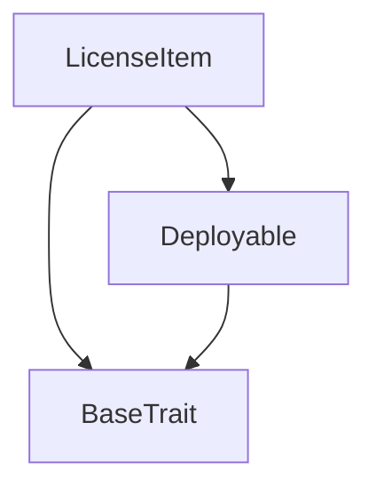
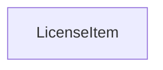

# Tact compilation report
Contract: LicenseItem
BoC Size: 1308 bytes

## Structures (Structs and Messages)
Total structures: 29

### DataSize
TL-B: `_ cells:int257 bits:int257 refs:int257 = DataSize`
Signature: `DataSize{cells:int257,bits:int257,refs:int257}`

### SignedBundle
TL-B: `_ signature:fixed_bytes64 signedData:remainder<slice> = SignedBundle`
Signature: `SignedBundle{signature:fixed_bytes64,signedData:remainder<slice>}`

### StateInit
TL-B: `_ code:^cell data:^cell = StateInit`
Signature: `StateInit{code:^cell,data:^cell}`

### Context
TL-B: `_ bounceable:bool sender:address value:int257 raw:^slice = Context`
Signature: `Context{bounceable:bool,sender:address,value:int257,raw:^slice}`

### SendParameters
TL-B: `_ mode:int257 body:Maybe ^cell code:Maybe ^cell data:Maybe ^cell value:int257 to:address bounce:bool = SendParameters`
Signature: `SendParameters{mode:int257,body:Maybe ^cell,code:Maybe ^cell,data:Maybe ^cell,value:int257,to:address,bounce:bool}`

### MessageParameters
TL-B: `_ mode:int257 body:Maybe ^cell value:int257 to:address bounce:bool = MessageParameters`
Signature: `MessageParameters{mode:int257,body:Maybe ^cell,value:int257,to:address,bounce:bool}`

### DeployParameters
TL-B: `_ mode:int257 body:Maybe ^cell value:int257 bounce:bool init:StateInit{code:^cell,data:^cell} = DeployParameters`
Signature: `DeployParameters{mode:int257,body:Maybe ^cell,value:int257,bounce:bool,init:StateInit{code:^cell,data:^cell}}`

### StdAddress
TL-B: `_ workchain:int8 address:uint256 = StdAddress`
Signature: `StdAddress{workchain:int8,address:uint256}`

### VarAddress
TL-B: `_ workchain:int32 address:^slice = VarAddress`
Signature: `VarAddress{workchain:int32,address:^slice}`

### BasechainAddress
TL-B: `_ hash:Maybe int257 = BasechainAddress`
Signature: `BasechainAddress{hash:Maybe int257}`

### Deploy
TL-B: `deploy#946a98b6 queryId:uint64 = Deploy`
Signature: `Deploy{queryId:uint64}`

### DeployOk
TL-B: `deploy_ok#aff90f57 queryId:uint64 = DeployOk`
Signature: `DeployOk{queryId:uint64}`

### FactoryDeploy
TL-B: `factory_deploy#6d0ff13b queryId:uint64 cashback:address = FactoryDeploy`
Signature: `FactoryDeploy{queryId:uint64,cashback:address}`

### Transfer
TL-B: `transfer#5fcc3d14 queryId:uint64 newOwner:address responseTo:address customPayload:Maybe ^cell forwardAmount:coins forwardPayload:remainder<slice> = Transfer`
Signature: `Transfer{queryId:uint64,newOwner:address,responseTo:address,customPayload:Maybe ^cell,forwardAmount:coins,forwardPayload:remainder<slice>}`

### Burn
TL-B: `burn#595f07bc queryId:uint64 = Burn`
Signature: `Burn{queryId:uint64}`

### GetStaticData
TL-B: `get_static_data#2fcb26a2 queryId:uint64 = GetStaticData`
Signature: `GetStaticData{queryId:uint64}`

### ReportStaticData
TL-B: `report_static_data#8b771735 queryId:uint64 index:uint256 collection:address = ReportStaticData`
Signature: `ReportStaticData{queryId:uint64,index:uint256,collection:address}`

### OwnerAssigned
TL-B: `owner_assigned#05138d91 queryId:uint64 prevOwner:address forwardPayload:remainder<slice> = OwnerAssigned`
Signature: `OwnerAssigned{queryId:uint64,prevOwner:address,forwardPayload:remainder<slice>}`

### Excesses
TL-B: `excesses#d53276db queryId:uint64 = Excesses`
Signature: `Excesses{queryId:uint64}`

### BuyerBurn
TL-B: `buyer_burn#7a1b3c5d queryId:uint64 = BuyerBurn`
Signature: `BuyerBurn{queryId:uint64}`

### RefundOnBurn
TL-B: `refund_on_burn#7e083215  = RefundOnBurn`
Signature: `RefundOnBurn{}`

### LicenseItem$Data
TL-B: `_ index:uint256 collection:address ownerAddress:address escrowAddress:address transferLimit:uint8 transfers:uint8 content:^cell burnDeadline:uint32 = LicenseItem`
Signature: `LicenseItem{index:uint256,collection:address,ownerAddress:address,escrowAddress:address,transferLimit:uint8,transfers:uint8,content:^cell,burnDeadline:uint32}`

### NftData
TL-B: `_ init:bool index:uint256 collection:address owner:address content:^cell = NftData`
Signature: `NftData{init:bool,index:uint256,collection:address,owner:address,content:^cell}`

### SoulboundInfo
TL-B: `_ transferLimit:uint8 transfers:uint8 = SoulboundInfo`
Signature: `SoulboundInfo{transferLimit:uint8,transfers:uint8}`

### MintLicense
TL-B: `mint_license#6a3aaa14 queryId:uint64 buyerAddress:address escrowAddress:address transferLimit:uint8 individualContent:^cell burnDeadline:uint32 = MintLicense`
Signature: `MintLicense{queryId:uint64,buyerAddress:address,escrowAddress:address,transferLimit:uint8,individualContent:^cell,burnDeadline:uint32}`

### BurnLicense
TL-B: `burn_license#4d8e8a14 queryId:uint64 itemAddress:address = BurnLicense`
Signature: `BurnLicense{queryId:uint64,itemAddress:address}`

### ChangeOwner
TL-B: `change_owner#4d8b8b8b queryId:uint64 newOwner:address = ChangeOwner`
Signature: `ChangeOwner{queryId:uint64,newOwner:address}`

### AppCollection$Data
TL-B: `_ appId:uint256 ownerAddress:address nextItemIndex:uint64 collectionContent:^cell commonContent:^cell = AppCollection`
Signature: `AppCollection{appId:uint256,ownerAddress:address,nextItemIndex:uint64,collectionContent:^cell,commonContent:^cell}`

### CollectionData
TL-B: `_ nextItemIndex:uint64 collectionContent:^cell owner:address = CollectionData`
Signature: `CollectionData{nextItemIndex:uint64,collectionContent:^cell,owner:address}`

## Get methods
Total get methods: 4

## get_nft_data
No arguments

## escrow_address
No arguments

## soulbound_info
No arguments

## burn_deadline
No arguments

## Exit codes
* 2: Stack underflow
* 3: Stack overflow
* 4: Integer overflow
* 5: Integer out of expected range
* 6: Invalid opcode
* 7: Type check error
* 8: Cell overflow
* 9: Cell underflow
* 10: Dictionary error
* 11: 'Unknown' error
* 12: Fatal error
* 13: Out of gas error
* 14: Virtualization error
* 32: Action list is invalid
* 33: Action list is too long
* 34: Action is invalid or not supported
* 35: Invalid source address in outbound message
* 36: Invalid destination address in outbound message
* 37: Not enough Toncoin
* 38: Not enough extra currencies
* 39: Outbound message does not fit into a cell after rewriting
* 40: Cannot process a message
* 41: Library reference is null
* 42: Library change action error
* 43: Exceeded maximum number of cells in the library or the maximum depth of the Merkle tree
* 50: Account state size exceeded limits
* 128: Null reference exception
* 129: Invalid serialization prefix
* 130: Invalid incoming message
* 131: Constraints error
* 132: Access denied
* 133: Contract stopped
* 134: Invalid argument
* 135: Code of a contract was not found
* 136: Invalid standard address
* 138: Not a basechain address
* 21543: Only owner can burn
* 22636: Trial window closed
* 29964: Soulbound or transfer limit exhausted
* 36952: Only owner can transfer
* 37629: Insufficient gas for mint
* 49958: Only current owner can rotate
* 57323: Only collection owner can mint
* 58313: Only collection owner can burn
* 59986: Only collection can burn

## Trait inheritance diagram

## Contract dependency diagram

