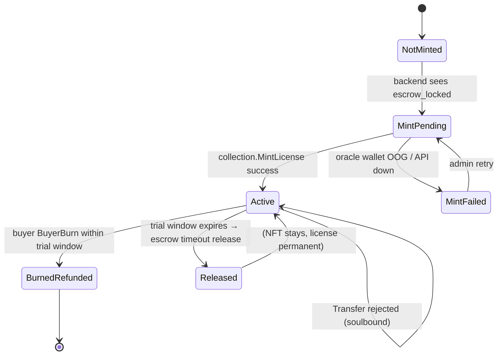
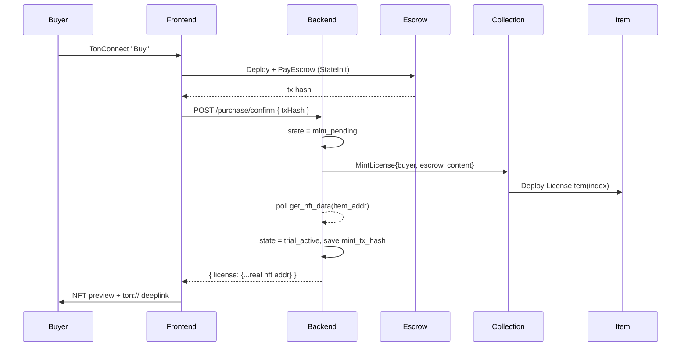
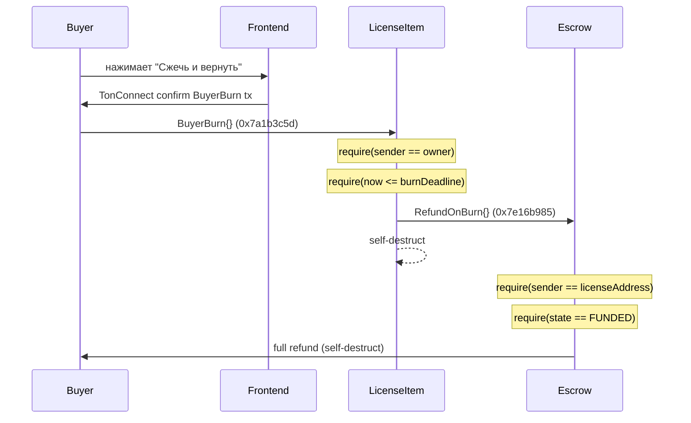

<!--
Канонический spec для License NFT защиты TonForge.
Описывает контракты, lifecycle, mint/verify/burn, threat model.
Любые изменения в реализации (контракты, backend onchain, frontend verify)
должны быть синхронизированы с этим документом.
-->

# License NFT Specification (TonForge)

## 1. Цель

Каждая успешная покупка приложения на TonForge сопровождается выпуском
неперeдаваемой (soulbound) NFT-лицензии в кошельке покупателя. NFT
выполняет три функции:

1. **Proof-of-purchase** — криптографическое доказательство, что
   покупатель оплатил конкретную версию артефакта (`sha256` зафиксирован
   в metadata).
2. **Entitlement key** — клиентское приложение и backend проверяют
   владение NFT перед выдачей артефакта/обновлений и активацией
   устройства.
3. **Refund anchor** — покупатель может сжечь NFT в течение trial window,
   что автоматически запускает возврат средств из escrow. Повторное
   использование лицензии после возврата невозможно.

Лицензия привязана к конкретному escrow-контракту покупки и к
конкретному `app_id`. Один `purchase_session` ⇒ один NFT.

## 2. Соответствие стандартам TON

| Контракт          | Стандарт      | Зачем                                                 |
| ----------------- | ------------- | ----------------------------------------------------- |
| `AppCollection`   | TEP-62        | Канонический `get_collection_data`, item-индексация   |
| `LicenseItem`     | TEP-64        | Канонический `get_nft_data`, off-chain metadata URI   |
| `LicenseItem`     | TEP-85 (idea) | Soulbound через `transfer_limit = 0`, не TEP-85 trait |

Мы **не** наследуем TEP-85 буквально (он требует authority-роль, что
дублирует `collection_owner`). Вместо этого soulbound реализован
полем `transferLimit` — если `transfers >= transferLimit`, входящий
`Transfer` отклоняется. Для лицензий `transferLimit = 0` всегда, для
коллекционных типов в будущем — `> 0`.

## 3. On-chain lifecycle



`Active` дополнительно может сменить логический подстатус
`device_bound` в БД, но это off-chain — на блокчейне состояние NFT не
меняется.

## 4. Контракты

### 4.1 AppCollection (TEP-62)

Один экземпляр на каждое приложение (`app_id`). Деплоится один раз через
[`contracts/scripts/deployCollection.ts`](../contracts/scripts/deployCollection.ts).

**Storage layout:**

```
appId            : Int as uint256          // TonForge appId как Int
ownerAddress     : Address                 // backend oracle wallet
nextItemIndex    : Int as uint64           // монотонный счётчик
collectionContent: Cell                    // off-chain TEP-64 URI
commonContent    : Cell                    // префикс для item URI
nftItemCode      : Cell                    // code BOC LicenseItem
```

**Сообщения:**

| Opcode      | Имя                  | Sender check                    | Эффект                                |
| ----------- | -------------------- | ------------------------------- | ------------------------------------- |
| `0x6a3...`  | `MintLicense`        | `sender() == ownerAddress`      | Деплой `LicenseItem(index)`, ++index  |
| `0x595...`  | `BurnLicense`        | `sender() == ownerAddress`      | Шлёт `Burn{}` существующему item      |
| `0x4d8...`  | `ChangeOwner`        | `sender() == ownerAddress`      | Ротация oracle wallet                 |

**Getters:** `get_collection_data() -> (next_item_index, content, owner)`,
`get_nft_address_by_index(index) -> Address`,
`get_nft_content(index, individual_content) -> Cell`.

### 4.2 LicenseItem (TEP-64 + soulbound)

Деплоится коллекцией. Адрес детерминирован по `(collection, index)`.

**Storage layout:**

```
index         : Int as uint64
collection    : Address
ownerAddress  : Address      // buyer wallet
escrowAddress : Address      // привязка к escrow покупки
transferLimit : Int as uint8 // 0 для license
transfers     : Int as uint8
burnDeadline  : Int as uint32 // unix timestamp, после которого BuyerBurn запрещён
content       : Cell         // individual TEP-64 metadata
```

**Сообщения:**

| Opcode       | Имя             | Sender check                                       | Эффект                                                      |
| ------------ | --------------- | -------------------------------------------------- | ----------------------------------------------------------- |
| `0x5fcc...`  | `Transfer`      | `sender() == ownerAddress`                          | `require(transfers < transferLimit)`, реджект для soulbound |
| `0x595...`   | `Burn`          | `sender() == collection`                            | self-destruct, return TON to `ownerAddress` (admin edge case)|
| `0x7a1b3c5d` | `BuyerBurn`     | `sender() == ownerAddress`, `now() <= burnDeadline` | Sends `RefundOnBurn{}` to escrow, self-destructs            |
| `0x2fcb...`  | `GetStaticData` | любой                                               | reply с (index, collection)                                 |

**Getters:** `get_nft_data() -> (init?, index, collection, owner, content)`,
`burn_deadline() -> Int`.

### 4.3 Code hash pinning

Скомпилированный `LicenseItem.code.boc` пинится в env как
`LICENSE_NFT_ITEM_CODE_BOC`. Backend перед минтом сверяет, что hash
совпадает с тем, что использует деплой коллекции. Это защищает от
подмены item-кода (если злоумышленник деплоит fake `AppCollection` с
другим `nftItemCode`, адреса не совпадут с теми, что вычисляет
backend).

## 5. Mint flow



Шаги в коде:
1. `confirmPurchaseSession()` помечает session `state = trial_active`,
   сохраняет license с `state = mint_pending`.
2. Параллельно вызывается `mintLicense()` в `backend/tonforge/onchain/`.
3. По успеху меняется `state = trial_active`, заполняется
   `mint_tx_hash` и реальный `nft_address`.
4. По ошибке состояние `mint_failed`, admin job из cron повторяет.

## 6. Verify flow

Используется в трёх местах:

1. **`activateLicenseDevice`** — перед записью device backend дёргает
   `verifyLicenseOwner(license.nftAddress, license.buyerWallet)`. Если
   `get_nft_data().owner != buyerWallet` — отказ.
2. **Frontend "Verify on-chain" badge** — кнопка в `/profile` дёргает
   `GET /api/tonforge/license/:id/verify`, который выполняет тот же
   verify и возвращает `{ ok, ownerOnchain, ownerExpected }`.
3. **Public artifact gate** (опционально, MVP+1) — раздача артефактов
   через signed URL, выписываемый только если verify OK.

```ts
// псевдокод verifyOwnership.ts
const { stack } = await tonClient.runMethod(nftAddress, 'get_nft_data');
const init = stack.readBoolean();
const index = stack.readNumber();
const collection = stack.readAddress();
const owner = stack.readAddress();
return owner.equals(Address.parse(expectedBuyer));
```

## 7. Buyer-Initiated Burn & Refund flow

Refund полностью on-chain и инициируется покупателем. Арбитраж
платформы не требуется.



**Важно:** после `burnDeadline` (unix timestamp = время покупки + trial window)
`BuyerBurn` отклоняется контрактом. Funds автоматически освобождаются
продавцу через `TimeoutRelease`.

Collection-mediated `Burn` (`sender == collection`) остаётся для
admin edge cases, но не используется в обычном пользовательском flow.

## 8. Off-chain metadata schema

`individual_content` LicenseItem содержит off-chain URI на JSON:

```json
{
  "name": "Cosmic Code Editor Pro — License #12",
  "description": "Lifetime NFT license bound to wallet EQB... and escrow EQD...",
  "image": "https://cdn.tonforge.org/license-art/cosmic-code-editor.png",
  "attributes": [
    { "trait_type": "App",          "value": "cosmic-code-editor" },
    { "trait_type": "App ID",       "value": "app_cosmic_code_editor" },
    { "trait_type": "SHA-256",      "value": "3d1b81d4f96c..." },
    { "trait_type": "License Type", "value": "SBT" },
    { "trait_type": "Escrow",       "value": "EQDEscrow..." },
    { "trait_type": "Trial Ends",   "value": "2026-04-21T10:00:00Z" },
    { "trait_type": "Soulbound",    "value": "true" }
  ]
}
```

Хостинг: пока — Appwrite Storage публичный bucket
`license-metadata`, ключ `${appId}/${index}.json`. Картинка
генерируется на этапе `publishApp` и хранится в bucket
`license-art`. Production-target — IPFS/pinata.

## 9. Mint/Burn authority

| Действие              | Кто может    | Контроль                                            |
| --------------------- | ------------ | --------------------------------------------------- |
| Deploy collection     | Oracle       | приватный mnemonic, в Coolify secret                |
| Mint license          | Oracle       | контракт: `sender() == owner`                       |
| Transfer license      | никто        | `transferLimit = 0`                                 |
| BuyerBurn (refund)    | Покупатель   | контракт: `sender() == ownerAddress`, `now <= deadline` |
| Burn (admin)          | Oracle       | контракт: `sender() == collection`                  |
| RegisterLicense       | Oracle       | контракт: `sender() == treasury` (Escrow)           |
| Rotate owner          | Oracle       | `ChangeOwner` от текущего owner                     |

Если oracle mnemonic утрачен/скомпрометирован, выполняется
`ChangeOwner` на новый wallet. Если wallet полностью утрачен (старый
ключ недоступен) — коллекция замораживается, и приложение
переезжает на новую коллекцию (старые лицензии остаются у держателей,
но новые минтить нельзя).

## 10. Threat model

### 10.1 Защищаем

- **Фейковая лицензия в БД без on-chain backing.** Backend-`verify`
  всегда обращается к `get_nft_data` — запись в БД без NFT не пройдёт.
- **Повторный минт на тот же `purchase_session`.** Unique constraint
  `licenses.purchase_session_id` + `nextItemIndex` строго растущий.
- **Передача лицензии другому пользователю.** Контракт отклоняет
  `Transfer` (soulbound).
- **Использование лицензии после refund.** Burn делает `get_nft_data`
  недоступным; verify возвращает `false` ⇒ artifact gate закрывается.
- **Подмена item-кода в коллекции.** `nftItemCode` фиксирован в
  StateInit коллекции; backend сверяет hash с pinned env-значением.

### 10.2 НЕ защищаем (по дизайну)

- **Decompile/reverse-engineering самого артефакта.** Это вне scope —
  лицензия защищает право на обновления, но не сам бинарник.
- **Шаринг скачанного файла вне платформы.** Off-chain, только
  watermarking уровня DRM может это закрыть (отдельный roadmap-item).
- **Compromise oracle wallet.** Если приватник украден, атакующий
  может минтить fake licenses. Митигация: hardware wallet для oracle
  в production, multisig в roadmap (вне MVP).

## 11. Соответствие БД

Расширения схемы (см. [`backend/sql/tonforge_schema.sql`](../backend/sql/tonforge_schema.sql)):

```sql
alter table licenses
  add column collection_index bigint not null,
  add column mint_tx_hash text,
  add column burn_tx_hash text;

-- enum state расширен значениями mint_pending, burn_pending, mint_failed.

create table app_collections (
  app_id uuid primary key references apps(app_id),
  collection_address text not null unique,
  owner_wallet text not null,
  deploy_tx_hash text not null,
  network text not null check (network in ('mainnet', 'testnet')),
  created_at timestamptz not null default now()
);

create index idx_licenses_nft_address on licenses (nft_address);
```

## 11.1 Listing requirements (NFT-mint bridge)

После соединения Commerce-checkout с NFT-минтом каждое активное `listing`
**обязано** иметь заранее задеплоенный `AppCollection`. Ограничения
кодифицированы на трёх уровнях:

1. **Schema** — `createListingSchema` (`backend/commerce/validation.ts`)
   требует `collectionAddress` в формате TON user-friendly адреса
   (`^[EUk0]Q[A-Za-z0-9_-]{46}$`). PATCH запрещает обнулять поле.
2. **Route** — `PATCH /listings/:id` отказывает в переходе в
   `status='active'`, если `collection_address` пуст (см.
   `backend/commerce/listingRoutes.ts`).
3. **Order confirm** — `ensureLicenseForOrder` бросает
   `ListingNoCollectionError`, если в момент `POST /orders/:id/confirm`
   у listing нет коллекции; `orderRoutes` отвечает 503
   `LISTING_NO_COLLECTION`. Это страховка для legacy-данных, проскочивших
   валидацию.
4. **Download gate** — `distributionRoutes` (через
   `backend/commerce/handlers/downloadGate.ts`) выдаёт файл только когда
   `license.state === 'minted' && license.nftAddress`. Любой другой
   статус — 425 (mint_pending) или 403 (всё остальное).

**Migration legacy-листингов.** Скрипт
[`scripts/migrate-suspend-no-collection.mjs`](../scripts/migrate-suspend-no-collection.mjs)
переводит все ACTIVE listing'и без `collection_address` в `suspended` и
логирует список для уведомления продавцов. Запускается с `--dry-run`
для предпросмотра.

## 12. Acceptance checklist

- [ ] `npm --prefix contracts run build` — собирает 3 контракта
      (Escrow, AppCollection, LicenseItem) без warnings.
- [ ] `npm --prefix contracts run test` — все 42 теста проходят, включая
      buyer-burn-refund lifecycle.
- [ ] `npm run typecheck` корня — проходит после backend/frontend
      изменений.
- [ ] Testnet smoke (см. [license-nft-runbook.md](./license-nft-runbook.md)):
  - Buyer покупает на testnet, NFT появляется в Tonkeeper testnet.
  - Oracle отправляет `RegisterLicense` в escrow.
  - `GET /api/tonforge/license/:id/verify` возвращает `ok: true`.
  - Buyer нажимает "Сжечь и вернуть" в UI, NFT сжигается, escrow
    возвращает средства покупателю.
  - `verify` после burn возвращает `ok: false`.
  - После trial window BuyerBurn отклоняется, timeout release работает.
